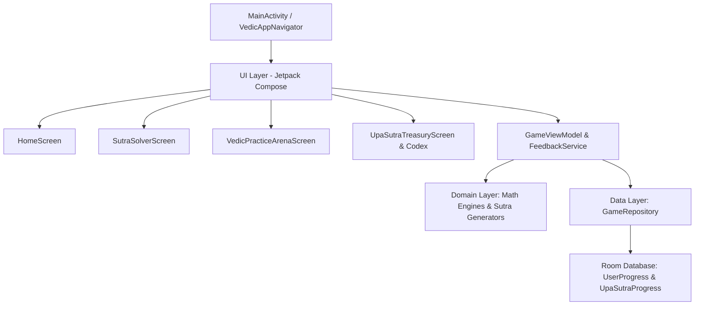

# 🕉️ Ankh: The Sutra Saga
### *A Sacred Geometry & Mental Arithmetic Educational Mobile Application*

[](https://github.com/Chitrank-Dixit/vedic_math_game/actions/workflows/android_ci.yml)
[](https://kotlinlang.org)
[](https://developer.android.com/jetpack/compose)
[](https://developer.android.com/training/data-storage/room)
[](LICENSE)

---

## 📖 Overview

**Ankh: The Sutra Saga** is a modern educational mobile application for mastering the ancient art of **Vedic Mathematics** through interactive gameplay, sacred geometric visualizers (*Yantras*), and step-by-step mental arithmetic drills.

The app systematically guides learners across **16 Primary Vedic Sutras** and all **13 Upa-Sutras (Sub-Sutras)**, providing instant cognitive decomposition of complex arithmetic (e.g. crosswise multiplication, deficiency squaring, polynomial synthetic division, and base subtraction).

---

## ✨ Key Features

- **🏛️ 16 Primary Sutra Worlds & 13 Upa-Sutras:** Comprehensive coverage from *Ekadhikena Purvena* (squaring 5s) to *Urdhva Tiryagbhyam* (crosswise multiplication) and *Paravartya Yojayet* (polynomial division).
- **📐 Interactive Sutra Solver (`SutraSolverScreen`):**
  - Live Canvas **Yantra Arrow Overlays** visualizing computational ray paths in real-time.
  - Dynamic carrying-number alignment and active step highlighting in Saffron (`#E65100`).
  - Collapsible **Formula Blueprint Drawer** with authentic Sanskrit shlokas and mental shortcut rules.
- **⚡ Speed Practice Arena (`VedicPracticeArenaScreen`):**
  - Timed 60-second challenge mode with rotating geometric **Mandala countdown timer**.
  - Real-time performance tracking: **Operations / Minute (`ops/min`)** and live scoring.
- **📜 The Upa-Sutra Codex & Treasury:**
  - Integrated reference scrolls and verified worked examples for all 13 classical Sub-Sutras.
- **🎨 Dual Theme Engine ("Sacred Geometry Meets Minimalist Math UI"):**
  - **Cosmic Midnight (Dark Mode):** `#0F172A` Slate background, luminous gold and emerald accents.
  - **Bhojpatra Parchment (Light Mode):** `#FDFBF7` Ancient manuscript parchment, saffron ink, and charcoal readability.
- **🔔 Haptic & Synthesized Audio Feedback:**
  - Coordinated Solfeggio bell chimes ($528\text{Hz}$), wood-tick key feedback ($800\text{Hz}$), and tactile vibration pulses.
- **🌟 Level Clear Celebration (`MandalaBurst`):**
  - 8-pointed radiant Mandala explosion upon completing lessons or achieving streak milestones.

---

## 🏛️ System Architecture

The application is structured using **Clean Architecture** and reactive state management:



### Module Breakdown:
- `com.ankh.sutrasaga.domain.models`: Pure mathematical entities, decomposition steps, and classification models.
- `com.ankh.sutrasaga.engine`: High-precision Vedic arithmetic generators (e.g. *Urdhva*, *Nikhilam*, *Adyamadya*, *Chalana-Kalana*).
- `com.ankh.sutrasaga.data.db`: Room SQLite DAOs and Entity mappings.
- `com.ankh.sutrasaga.ui.components`: Reusable sacred geometry components (`VedicSutraCard`, `YantraProgressRing`, `MentalMathNumpad`, `VedicAppLogo`, `MandalaBurst`, `VedicMotifs`).
- `com.ankh.sutrasaga.ui.theme`: Dynamic design tokens (`VedicTokens`), dual-font typography with OpenType tabular numbers (`tnum`), and theme provider.

---

## 🚀 Getting Started & Build Instructions

### Prerequisites
- **JDK:** Java 17 (Eclipse Temurin or OpenJDK 17)
- **Android SDK:** API Level 34 (compileSdk 34, minSdk 24)
- **Android Studio:** Hedgehog (2023.1.1) or newer

### Clone & Build
```bash
# Clone the repository
git clone https://github.com/Chitrank-Dixit/vedic_math_game.git
cd vedic_math_game

# Run unit test suite (266+ tests)
./gradlew test

# Assemble Debug APK
./gradlew assembleDebug
```

### Deploy to Connected Device or Emulator
```bash
# Install and run on connected Android emulator/device
adb install -r app/build/outputs/apk/debug/app-debug.apk
adb shell am start -n com.ankh.sutrasaga/.MainActivity
```

---

## 🧪 Testing & Quality Assurance

The codebase includes an extensive automated test suite covering math generation engines, repository persistence, ViewModels, and UI state coordinators:

```bash
# Run all unit tests with full report generation
./gradlew testDebugUnitTest
```
*Test reports are generated at `app/build/reports/tests/testDebugUnitTest/index.html`.*

---

## 📄 License

This project is licensed under the **MIT License** — see the [LICENSE](LICENSE) file for details.

Copyright (c) 2026 Chitrank Dixit.
