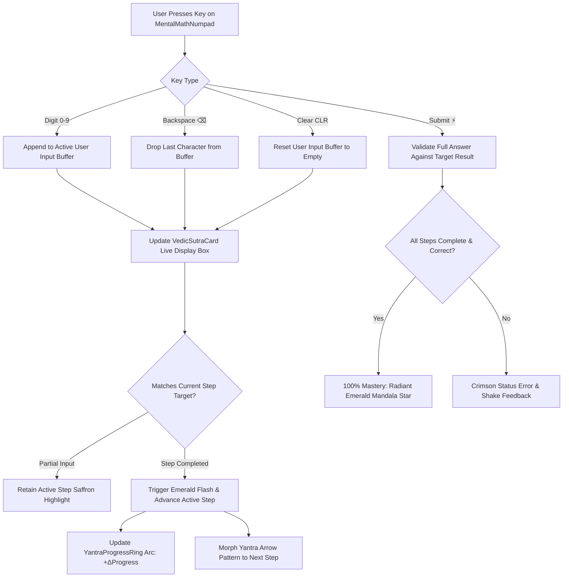

# Vedic Mathematics Math Input & Core Components Specification
**Phase 2: Sacred Geometry Meets Minimalist Math UI**

---

## 1. Architectural Overview & Component System

The Vedic Mathematics Mental Arithmetic UI is built on a responsive 3-tier component architecture:

```
+-------------------------------------------------------------+
|                      VedicSutraCard                         |
|  +-------------------------------------------------------+  |
|  | Header: Sanskrit / English + YantraProgressRing (Mini)|  |
|  +-------------------------------------------------------+  |
|  | Numerical Math Grid: Monospace + Carry Display        |  |
|  | [Overlay]: Animated Yantra Geometric Arrow Rays       |  |
|  +-------------------------------------------------------+  |
|  | Step-by-Step Breakdown (Active Saffron Highlight)     |  |
|  +-------------------------------------------------------+  |
|  | Live Input Display Box (Emerald Mastery Feedback)     |  |
|  +-------------------------------------------------------+  |
+-------------------------------------------------------------+
                              ▲
                              │ State Updates & Reactive Steps
                              │
+-------------------------------------------------------------+
|                     MentalMathNumpad                        |
|  [1] [2] [3]                                                |
|  [4] [5] [6]  --> Rapid Thumb Input with Golden Micro-Glow  |
|  [7] [8] [9]                                                |
|  [CLR] [0] [⌫]                                              |
|  [ SUBMIT ANSWER ⚡ ]                                       |
+-------------------------------------------------------------+
```

---

## 2. Math Logic Interaction Flowchart

The following flowchart details the reactive cycle between user input on `MentalMathNumpad`, state validation, step transition, and geometric ray updates on `VedicSutraCard`:



---

## 3. Animation Specifications & Keyframe Definitions

### A. `YantraProgressRing` Animation Matrix

| State | Animation Property | Duration / Curve | Visual Effect |
| :--- | :--- | :--- | :--- |
| **Ambient Idle** | `rotation` (0° → 360°) | `24000ms`, `Linear` continuous | Subtle rotation of 8 geometric ray ticks |
| **Progress Advance** | `strokeDashoffset` | `600ms`, `FastOutSlowIn` | Smooth sweep of radiant saffron gradient arc |
| **100% Mastery** | `colorPulse` (0.6 → 1.0) | `1500ms`, `FastOutSlowIn` (Reverse) | Emerald green bloom radiating through 8-pointed mandala star |

### B. `MentalMathNumpad` Key-Press Animation

```css
@keyframes keyPressGlowDark {
  0% {
    transform: scale(1.0);
    box-shadow: 0 0 0px rgba(255, 215, 0, 0);
    border-color: rgba(255, 215, 0, 0.25);
  }
  50% {
    transform: scale(0.92);
    box-shadow: 0 0 14px rgba(255, 215, 0, 0.45);
    border-color: #FFD700;
  }
  100% {
    transform: scale(1.0);
    box-shadow: 0 4px 16px rgba(0, 0, 0, 0.4);
    border-color: rgba(255, 215, 0, 0.25);
  }
}
```

---

## 4. Geometric Yantra Arrow Patterns (Step Visualizer)

For multi-digit multiplication (e.g. *Urdhva Tiryagbhyam* $23 \times 14$):

1. **Step 1 (`VERTICAL_RIGHT`)**: Vertical golden ray through units columns ($3 \times 4 = 12$, write $2$, carry $1$).
2. **Step 2 (`CROSSWISE`)**: Saffron X-rays through diagonal pairs ($2 \times 4 + 3 \times 1 + 1 = 12$, write $2$, carry $1$).
3. **Step 3 (`VERTICAL_LEFT`)**: Vertical ray through tens column ($2 \times 1 + 1 = 3$, write $3 \rightarrow 322$).
