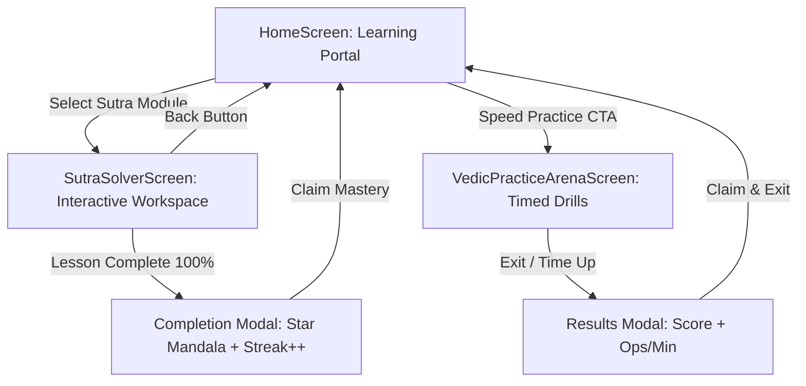

# Vedic Mathematics Screen Architecture & Workflows
**Phase 3: Core Screen Architectures, Workflows & App Routing Engine**

---

## 1. System Navigation Architecture & Flow

The application coordinates three core screens through a fluid state-driven navigator:

---

## 2. Screen Specifications & Layout Contracts

### 01. `HomeScreen` (Launch Portal)
- **Top Header**:
  - 7-Day Sutra Streak badge in `secondaryGold` with glowing star.
  - Reactive `VedicThemeSwitcher` toggle (Bhojpatra Parchment <-> Cosmic Midnight).
- **Speed Practice CTA Banner**:
  - Saffron gradient card (`primarySaffron`) prompting instant entry into timed mental math drills.
- **Sutra Learning Categories**:
  1. *Multiplication Shortcuts* (e.g. *Urdhva Tiryagbhyam*, *Ekadhikena Purvena*)
  2. *Squaring & Cubing* (e.g. *Yavadunam*)
  3. *Division & Reciprocals* (e.g. *Paravartya Yojayet*)
- **Embedded Visualizers**: Mini `YantraProgressRing` tracking module mastery percentage.

### 02. `SutraSolverScreen` (Interactive Learning Workspace)
- **Navigation & Blueprint Drawer**:
  - Collapsible formula blueprint showing the Sanskrit shloka, literal translation, and operational mental shortcut.
- **Main Workspace (`VedicSutraCard`)**:
  - Live primary equation display in tabular monospace figures (`JetBrains Mono`, `tnum`).
  - Active step highlight in `primarySaffron`.
  - Dynamic Yantra geometric arrows (vertical multiplication rays, crosswise diagonal X-rays).
  - Carrying digits row.
- **Input Area (`MentalMathNumpad`)**:
  - Pinned to bottom thumb zone for rapid, distraction-free input.
  - Correct input advances step with emerald flash (`statusSuccess`).
  - Incorrect input triggers horizontal error shake and red border (`statusError`).

### 03. `VedicPracticeArenaScreen` (Timed Challenge Arena)
- **Header & Mandala Timer**:
  - Rotating geometric countdown ring (`YantraProgressRing`) pulsing in saffron when under 10 seconds.
  - Live score counter & operational speed metric (Operations / Min).
- **Central Focus Zone**:
  - Minimalist, high-contrast equation card with instant keypress verification.
- **Time Up Modal**:
  - Displays final score and operations per minute with instant claim action.
